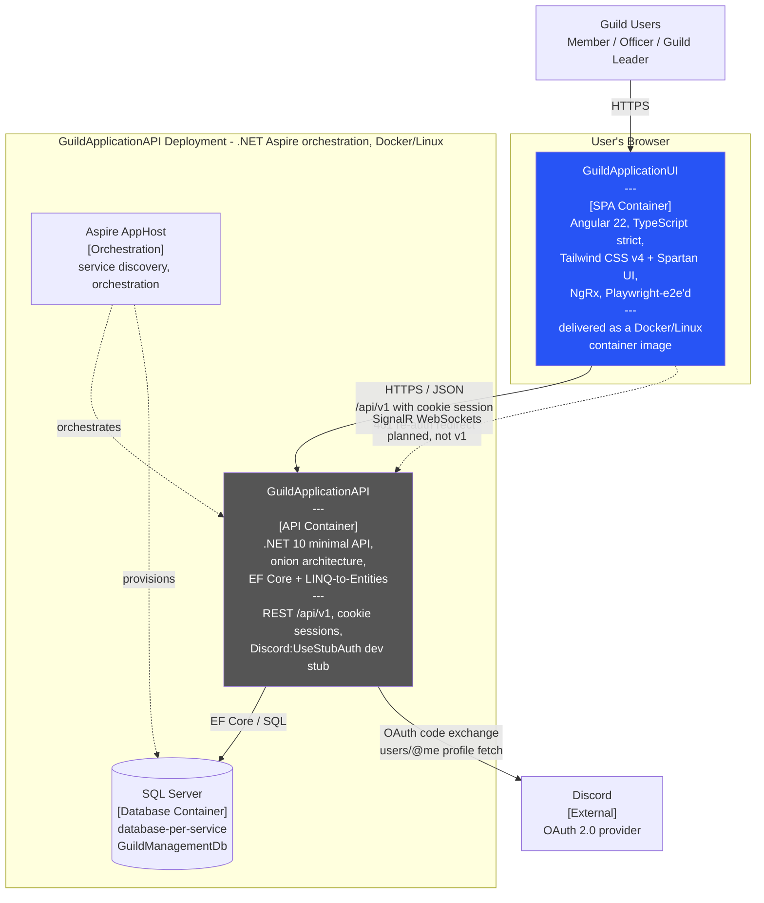

# C2 — Container Diagram

**Level:** C4 model, Level 2 (Containers)
**Represents:** the deployable units of the guild management system and their
interactions, per the constitution v1.4.0 containerization standard.

## Notes

- **SPA container**: the Angular application is built to static assets and
  served from a Docker/Linux image (tasks.md T077, spec NFR-005); the
  production build is what the container runs.
- **API container**: owned by the GuildApplicationAPI repository — this
  diagram records only the integration surface the UI depends on
  (contracts/api-client.md is the authoritative consumption contract).
- **Sessions**: cookie-based with `withCredentials`; dev uses a proxy for
  `/api` (research.md R5 — swap point if the backend chooses tokens).
- **Times**: the API returns UTC; conversion to the user's configured
  timezone happens inside the SPA (research.md R6).