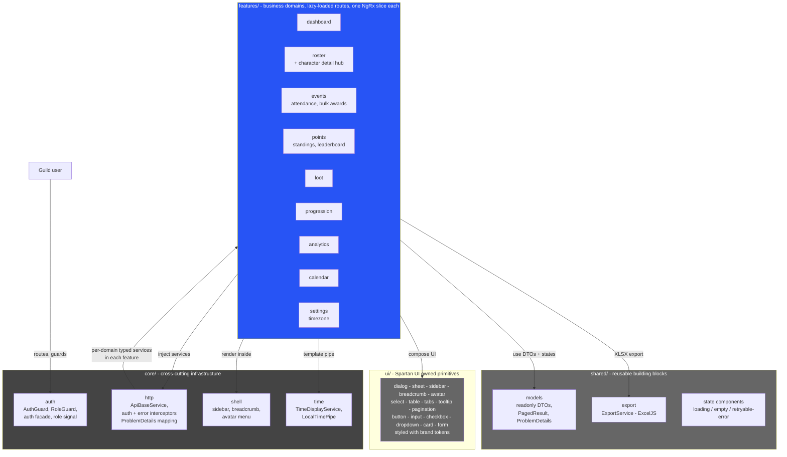

# C3 — Component Diagram

**Level:** C4 model, Level 3 (Components)
**Represents:** the frontend application's internal component structure —
the DDD organization mandated by constitution Principle VIII and plan.md.

## Notes

- **Smart vs dumb (Principle VIII)**: containers at feature roots read NgRx
  signal selectors and dispatch actions; presentation components live in
  `shared/` and `ui/` and communicate only via `@Input()`/`@Output()`.
- **One slice per domain**: each `features/<domain>/` owns its API service,
  NgRx slice (Store + Effects + entity + signal selectors), and views —
  data-model.md documents the nine slices.
- **Error contract**: `core/http` interceptors translate ProblemDetails into
  the per-domain UX (inline 400s, 401 redirect, friendly 403/409, 429 pacing,
  502/503 states) per contracts/api-client.md.
- **Cross-domain linking**: the character detail hub (roster) hosts tabs that
  other domains wire into (points, loot, progression) per tasks.md T033.