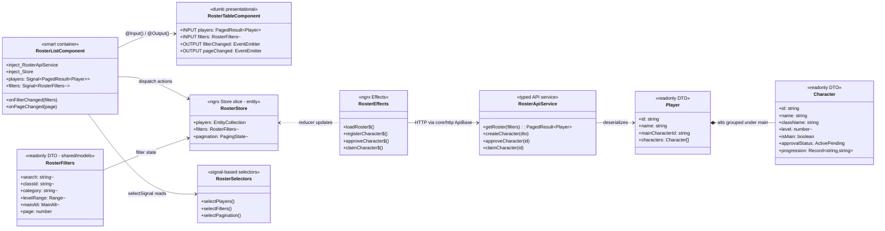

# C4 — Code Diagram (Representative Domain: Roster)

**Level:** C4 model, Level 4 (Code)
**Represents:** the code-level pattern every feature domain follows, using
the roster domain (tasks.md T025–T033) as the worked example. Other domains
replicate this shape with their own entities and services.

## Notes

- **Constitution mappings**: smart/dumb separation (Principle VIII),
  `inject()` over constructor DI (Principle II), readonly DTOs (Principle III),
  one service per domain (Technology & Testing Standards).
- **Slices**: the NgRx slice composition (`Store` + `Effects` + entity +
  signal selectors) is the same in all nine domains — research.md R3.
- **Full field definitions**: see `specs/001-guild-management-ui/data-model.md`;
  this diagram shows shape, not the complete validation rule set.
- **Traceability**: task IDs for this domain appear in tasks.md Phase 4
  (T025–T033) and GitHub ticket #4.