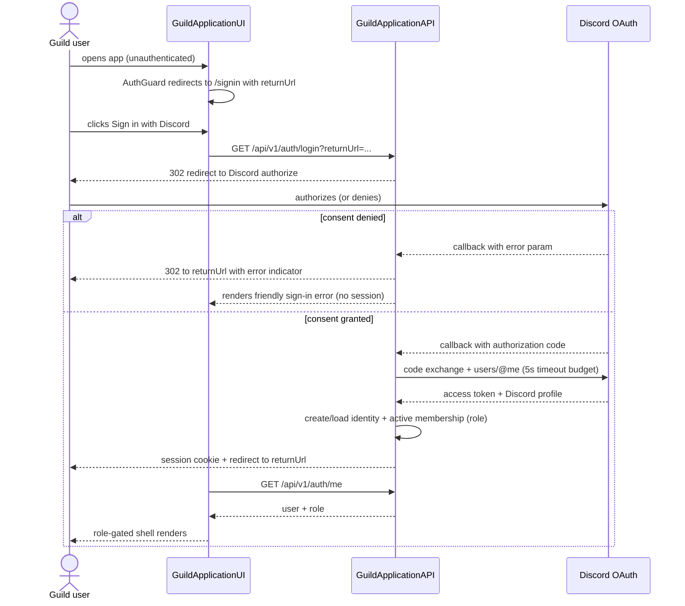
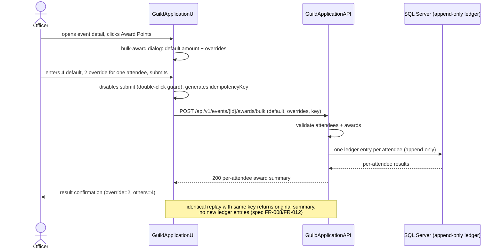

# Sequence Diagrams — Primary User Journeys

**Level:** UML sequence diagrams (constitution v1.5.0 System documentation
standard: sequence diagrams for the primary user journeys).
Derived from the spec's user stories (US1, US3, US2) and
contracts/api-client.md.

## 1. Discord Sign-In (US1)



## 2. Event Bulk Point Award (US3, spec FR-012)



## 3. Roster Browse with Filters (US2, spec FR-006)

```mermaid
sequenceDiagram
    actor Member as Member
    participant SPA as GuildApplicationUI
    participant Store as NgRx roster slice
    participant API as GuildApplicationAPI

    Member->>SPA: navigates to /roster (lazy route loads)
    SPA->>Store: dispatch loadRoster (initial filters)
    Store->>API: GET /api/v1/roster?search=&class=&page=1
    API-->>Store: PagedResult<Player> (mains + nested alts, totals)
    Store-->>SPA: entity state updated
    SPA-->>Member: roster table renders (loading skeleton -> data)
    Member->>SPA: filters by class + level range
    SPA->>Store: dispatch loadRoster (updated filters)
    Store-->>SPA: new page state
    SPA-->>Member: table updates; filter chips shown, clearable
    note over SPA: empty state / retryable error states per FR-005;<br/>Export button exports the current filtered view to XLSX (FR-029)
```

## Notes

- All API responses carry **UTC** timestamps; `LocalTimePipe` renders them in
  the user's configured timezone (spec FR-025) — omitted here for brevity.
- 401 at any step redirects to `/signin` with `returnUrl` (spec US1.6).
- These journeys correspond to spec acceptance scenarios and are covered by
  the Playwright e2e specs (`e2e/us1-auth.spec.ts`, `e2e/us3-events.spec.ts`,
  `e2e/us2-roster.spec.ts`).